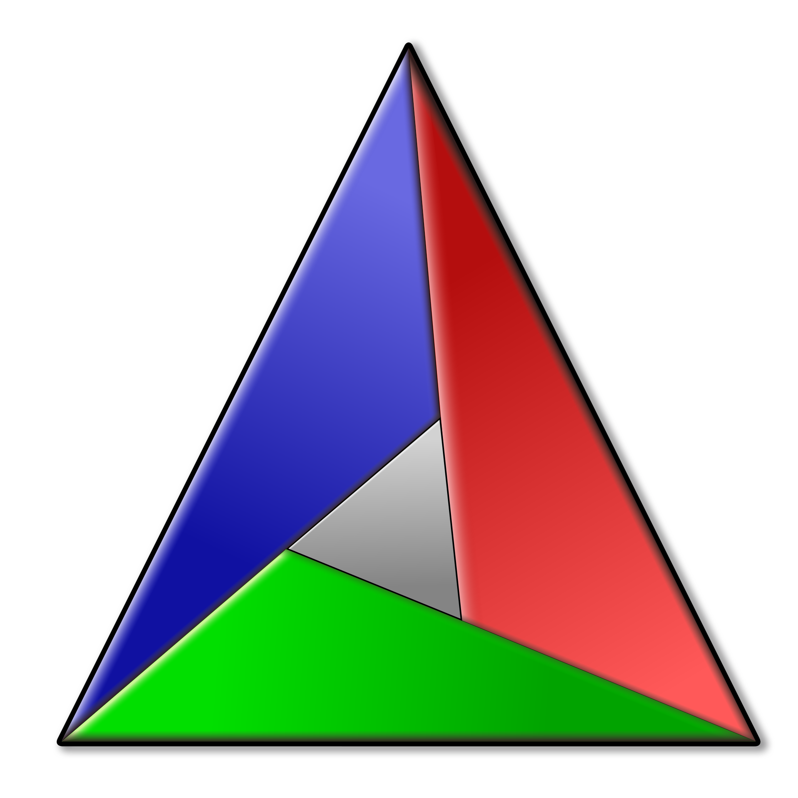
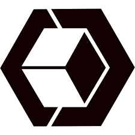
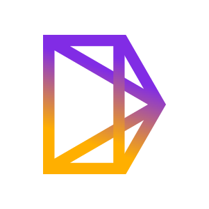
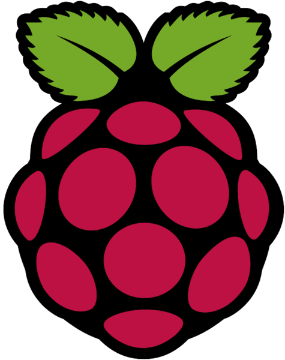

<h1 align="center">
  Hello I'm Jingwen Wang
</h1>

[//]: # ()

   

[//]: # (
)

[//]: # (  )

[//]: # (
)

  

[//]: # (
)

[//]: # (  )

[//]: # (
)
 

- 🌱 I’m currently a Ph.D. student at the [CDT in Foundational AI](https://www.ucl.ac.uk/ai-centre/) at University College London (UCL).
- 🔭 My research interest lies in object-aware semantic SLAM and 3D reconstruction, combining object-level scene understanding and SLAM systems using learning-based approaches.
- ⚡ My personal website: [https://jingwenwang95.github.io/](https://jingwenwang95.github.io/)
- 📫 How to reach me: [jingwen.wang.17@ucl.ac.uk](jingwen.wang.17@ucl.ac.uk)

[//]: # (**I'm expected to graduate in the end of 2023 and am looking for full-time research engineer/scientist positions in SLAM/robotics/3D Vision starting from spring 2024. Please feel free to reach out if you have potential job/post-doc opportunities!**)

<h2 align="center">
  Languages & Tools
</h2>

  <!-- https://icons8.com/icons -->
  
  
  
  
  
  

  
  
  
  
  

  
  
  

  <!---  --->
  
  

  

<!-- 

  

 -->

[//]: # (<h2 align="center">)

[//]: # (  Links)

[//]: # (</h2>)

[//]: # (
)

[//]: # (  <a href="https://jingwenwang95.github.io">https://jingwenwang95.github.io</a>)

[//]: # (  </ul>)

[//]: # (
)

<!--
Taken from: https://github.com/charlesCXK
Here are some ideas to get you started:

- 🔭 I’m currently working on ...
- 🌱 I’m currently learning ...
- 👯 I’m looking to collaborate on ...
- 🤔 I’m looking for help with ...
- 💬 Ask me about ...
- 📫 How to reach me: ...
- 😄 Pronouns: ...
- ⚡ Fun fact: ...
-->

